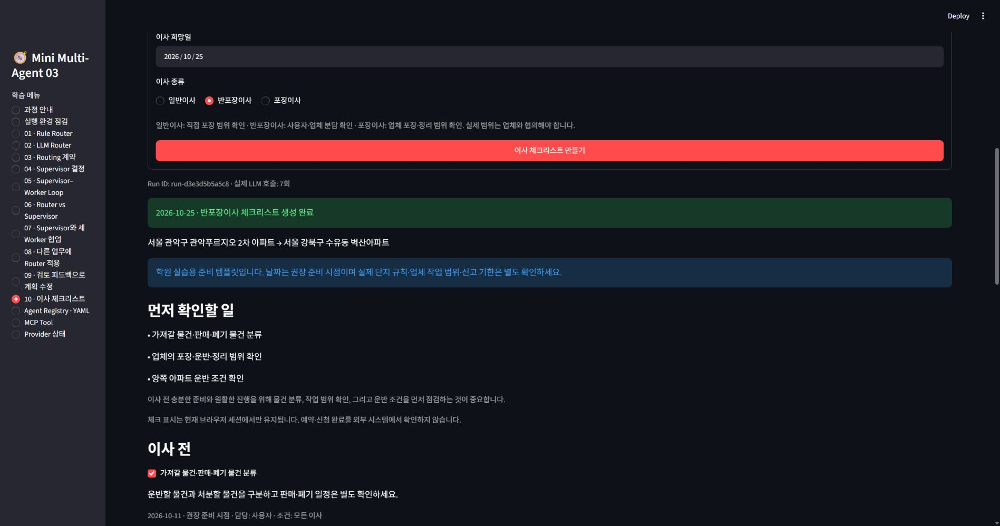

# Lab 10 · 이사 체크리스트 멀티에이전트 제출 문서

## 시나리오와 범위

사용자가 출발지·도착지·이사 희망일·일반/반포장/포장이사를 선택하면 Supervisor와 세 Worker가 이사 전·당일·후 체크리스트를 만든다. 대표 사례는 서울 관악구 관악푸르지오 2차 아파트에서 서울 강북구 수유동 벽산아파트로 이사하는 경우다. 아파트 이름은 사용자 입력이며 실제 단지 규칙을 조회한 결과가 아니다.

이번 과제는 체크리스트 생성까지다. SH 임대주택 퇴거, 견적, 예약, 결제, 실제 외부 데이터 API 및 업무 DB 연동은 포함하지 않는다. LLM은 실제 OpenAI Provider를 사용하고, 준비 항목 Tool만 Mock이다. 보유 물품이 확인되지 않았으므로 가전·폐기·통신 항목은 적용 조건을 표시한다.

## 사용 방법

1. http://localhost:8501/ 접속 → 사이드바 **10 · 이사 체크리스트** 선택.
2. 출발지·도착지·희망일·이사 종류 선택 → **이사 체크리스트 만들기**.
3. Run ID, 현재 Agent, 진행 이력을 확인한다.
4. 먼저 확인할 일과 이사 전·당일·후 체크리스트를 확인한다.
5. 항목을 체크하거나 JSON을 다운로드한다. 체크 상태는 현재 브라우저 세션에만 유지된다.
6. 하단의 **과제 확인: Supervisor·Worker 실행 Trace와 계약**에서 단계별 계약과 의미 검증을 확인한다.

## Agent → Contract → Orchestration

| 구성 | 책임 | 출력 계약 | Tool |
| --- | --- | --- | --- |
| moving_supervisor_agent | 검증된 State를 보고 다음 Worker 또는 finish 선택 | MovingSupervisorDecision | 없음 |
| move_scope_agent | 네 가지 사용자 조건을 그대로 보존하고 요약 | MoveScopeResult | 없음 |
| move_checklist_agent | 준비 템플릿 항목별 실행 문장 작성 | MoveChecklistResult | get_moving_checklist_template |
| move_timeline_agent | 모든 항목을 단계별로 배치하고 우선 확인 항목 선정 | MoveTimelineResult | 없음 |

~~~text
사용자 입력 검증
 → Supervisor → 조건 Worker → 조건 계약·원본 일치 검증
 → Supervisor → 체크리스트 Worker → Mock MCP 조회·Tool 계약 검증
                                      → 체크리스트 계약·ID 누락/중복 검증
 → Supervisor → 일정 Worker → 일정 계약·ID/단계/순서 검증
 → Supervisor → finish → 최종 체크리스트
~~~

정상 실행은 Supervisor 4회 + Worker 3회 = 실제 LLM 7회, Mock MCP Tool 1회다. 최초 순서는 수업 예제처럼 제한되어 있다. Supervisor는 선택을 제안하고 Python은 허용 전이·검증 결과·최대 호출을 최종 통제한다. 검증에 실패한 결과는 완료 State에 넣지 않고 후속 Worker를 실행하지 않는다.

## Contract와 검증

- Pydantic: 필수 필드, 타입, 고정 agent_id, 이사 종류, 허용 단계, 추가 필드 금지.
- 입력: 공백 출발지·도착지 및 서울 기준 과거 희망일 차단.
- 의미 검증: 사용자 조건 보존, Mock 템플릿 ID와 체크리스트 ID의 정확한 일치, 중복·없는 ID 차단.
- 일정 검증: 모든 항목 한 번씩 포함, 템플릿 단계 유지, 이사 전→당일→후 순서, 우선 항목이 이사 전 대상인지 확인.
- 준비 날짜: Python이 Mock days_offset과 희망일로 계산한다. 이미 지난 이사 전 준비 시점은 오늘 날짜와 ‘지금 확인할 일’로 표시한다. 권장일은 법적 기한이 아니다.

제목·적용 조건·담당·권장 날짜는 검증된 템플릿과 Python 결과를 사용한다. LLM이 쓰는 action 문장의 모든 의미를 자동 증명하지는 못하므로, 템플릿 기반 지시와 조건 표시를 함께 사용한다.

## 파일 구성

| 파일 | 내용 |
| --- | --- |
| backend/app/agents/definitions/moving_workers.yaml | 세 Worker의 역할·Provider·계약·Tool 선언 |
| backend/app/agents/loader.py | YAML을 AgentProfile로 변환 |
| backend/app/agents/registry.py | Python Supervisor와 YAML Worker 통합 등록 |
| backend/app/agents/moving_supervisor_agent.py | 이사 Supervisor Profile |
| backend/app/agents/runtime.py | 기존 실행 유지, 명시적 Tool 인자와 Tool 계약 검사 확장 |
| backend/app/schemas/moving.py | 요청·Worker·Supervisor·Mock Tool 계약 |
| mcp_server/tools/moving_tools.py | DB·외부 API 없이 종류별 30개 준비 항목 반환 |
| mcp_server/main.py | 기존 Tool 목록에 Mock Tool 추가 |
| backend/app/orchestration/moving_supervisor.py | State, 단계 선택, 전이·의미 검증, 일정, Trace |
| backend/app/routers/workflow.py | 동기/비동기 이사 URL 등록 |
| backend/app/services/catalog.py | 학습 메뉴 10 정보 |
| frontend/app.py | 10번 입력 폼·진행 조회·체크리스트·Trace |
| tests/test_moving_flow.py | 성공·실패·전달·날짜·라우터 테스트 |

기존 프로젝트의 등록 파일은 register.py가 아니라 registry.py다. YAML의 output_contract는 계약 이름이고 실제 클래스는 Orchestrator의 SCHEMAS로 연결한다. engine.py의 기존 사용자 수정은 유지하고 이사 흐름은 별도 파일에 작성했다.

## Swagger 테스트

http://127.0.0.1:8000/docs 접속 후 다음 요청을 실행한다.

~~~json
{
  "origin": "서울 관악구 관악푸르지오 2차 아파트",
  "destination": "서울 강북구 수유동 벽산아파트",
  "moving_date": "2026-10-09",
  "moving_type": "semi_packing"
}
~~~

날짜는 실행하는 날 또는 이후로 바꾼다. 일반이사는 general, 반포장이사는 semi_packing, 포장이사는 full_packing이다.

| API | 확인 내용 |
| --- | --- |
| GET /api/agents | Supervisor와 세 Worker 등록 |
| GET /api/mcp-status | get_moving_checklist_template 등록 |
| POST /api/runs/moving-checklist | 직접 실행 결과·Run ID·Trace |
| POST /api/async-runs/moving-checklist | queued와 Run ID 반환 |
| GET /api/async-runs/{run_id}/snapshot | 현재 Agent·이력·최종 결과 조회 |

동기 실행은 Redis 없이 사용할 수 있다. 화면의 비동기 진행 조회는 기존 Redis를 사용한다. Redis는 실행 추적용이며 이사 업무 DB가 아니다. 기본 TTL이 지나면 Run ID 이력이 만료된다.

## 검증 기록

2026-09-30: 기존 테스트 23개와 이사 테스트 12개, 총 35개 자동 테스트 통과. 세 이사 종류, 입력 오류, 원본 조건 변경, 항목 누락·중복·없는 ID, 단계 오류, 잘못된 Supervisor 선택, Tool 실패 시 중단, 임박 날짜, 동기·비동기 라우팅, 실제 Pydantic 날짜의 JSON 직렬화를 검사했다. 자동 테스트에서는 Provider 응답을 제어해 실패 경로를 재현하며 실제 LLM 결과와 구분한다.

실제 OpenAI gpt-4.1-mini와 MCP 서버를 사용한 실행 결과:

| 실행 방법 | 이사 종류 | Run ID | 결과 |
| --- | --- | --- | --- |
| Swagger 직접 실행 | 일반이사 | run-5e67bf062a79 | completed, 7 LLM calls, 12개 항목 |
| Streamlit 10번 메뉴 | 반포장이사 | run-d3e3d5b5a5c8 | completed, 7 LLM calls, 12개 항목 |
| 비동기 API·snapshot 조회 | 포장이사 | run-89d038a1bc86 | completed, 7 LLM calls, 12개 항목 |

첫 화면 실행에서 날짜 직렬화 오류를 발견해 Runtime을 model_dump(mode="json")으로 수정하고 회귀 테스트를 추가한 후 정상 완료를 확인했다. Mock Tool은 실제 MCP 경로로 호출했고 Provider 실패를 고정 답변으로 대체하지 않았다.

Swagger에서 빈 origin으로 요청해 HTTP 422와 origin 필드 오류를 확인했다. 화면에서는 체크박스를 선택한 뒤에도 기존 Run ID와 생성 결과가 유지되는 것을 확인했다.

## PDF 참고 보완 (2026-09-30)

기본 이사 희망일은 2026년 10월 9일이다. Supervisor의 선택 이유(reason)는 한글 문장으로 출력하도록 지시한다. Agent ID와 내부 종료 코드는 기존 식별자를 유지한다.

아정당 이사 체크리스트(2025)의 1~4쪽 요약과 10~22쪽 설명에서 준비 주제를 참고해 기존 12개 항목을 30개로 보완했다. 새집 점검·수리·청소, 전학·돌봄, 금융·우편·정기배송 주소, 폐기물·봉투, 냉장고 정리, 가구 배치, 도시가스 이전, 자동이체, 세탁기 준비, 일정 최종 확인, 결제·입주 서류, 사진 기록, 정산·열쇠 인계, 새집 보안·개통, 주차 등록을 포함한다.

4개 입력만으로 보유 가전·가족·계약 상태를 알 수 없으므로 해당 조건을 명시하며 불필요한 항목은 사용자가 제외한다. PDF의 광고·2025년 가격·손 없는 날·법적 기한·일률적인 작업 방법은 적용하지 않는다. 권장일이 지난 준비 항목은 '지금 확인할 일'로 표시한다. 위 실제 실행 기록과 화면 이미지는 보완 전 12개 버전의 기록이다.

## 추가 참고사항 담당 에이전트

현재 실행 순서는 총괄 에이전트의 선택 아래 조건 정리 → 참고사항 정리 → 체크리스트 작성 → 일정 정리이다. 네 담당 에이전트와 총괄 결정 5회를 합해 최대 9회 언어 모델을 호출한다.

move_notes_agent는 기존 YAML Loader·Registry·실제 Provider Runtime을 재사용한다. MoveNotesResult 계약은 source_notes(원문), summary(한글 요약), facts(분류·내용·원문 인용 근거)를 반환한다. 가져갈 물품, 판매, 폐기, 서비스 작업, 제약, 가족 상황, 우선 확인 희망을 구분한다. 원문 보존과 인용 구절 존재를 검증한 뒤 체크리스트·일정 담당에게 notes로 전달하며, 검증 실패 시 후속 실행을 중단한다. 빈 참고사항도 정상 처리한다. 인용 근거 검증만으로 요약의 모든 의미가 정확함을 보장하지는 않으므로 사용자는 펼침 영역에서 정리 결과를 확인할 수 있다.

자동 테스트는 총 39개 통과했다. 참고사항의 전달, 원문 변경·없는 근거 시 중단, 빈 참고사항, 실제 Provider Runtime 호출 경로를 검사했다. 테스트의 모델 응답은 제어한 값이며 실제 모델 실행 성공의 증거와 구분한다.

## 결과 기반 Supervisor 보완

Supervisor에는 입력·검증된 실제 Worker 결과·직전 실행 결과와 오류·작업 이력·실행 횟수를 전달한다. MovingSupervisorDecision의 task 필드로 다음 작업이나 수정 지시를 전달한다. 고정 순서 비교 대신 선행 계약이 준비된 Worker 중에서 다음 작업을 선택하며 완료된 Worker의 결과 수정도 허용한다. 상위 결과 재작업 시 종속 결과는 무효화한다.

Worker별 실행은 최대 두 번이다. 정상 호출은 9회, 재작업 포함 전체 모델 호출 한도는 17회이다. 실패한 계약은 검증된 outputs에 넣지 않고 오류를 Supervisor에 보고하며, 필수 결과가 없으면 후속 실행과 finish를 차단한다. 재실행 한도나 전체 한도에 도달하면 종료한다. 형식·의존성·원문 근거 검증은 Python이 수행하고, 내용의 적절성은 Supervisor가 검토한다. 모델 판단의 정확성을 보장하는 것은 아니며 Trace에서 한글 판단 이유와 수정 지시를 확인할 수 있다.

## 업무별 Worker 적용 완료 (현재 버전)

앞 절의 단계별 Agent 설명과 실행 기록은 이전 버전이다. 현재는 참고사항 정리 담당과 업무별 Worker 네 명(물품·포장, 판매·폐기, 생활 서비스, 주거·당일)을 사용한다. 기존 조건 정리·전체 체크리스트·일정 담당은 실행 Registry에서 제거했고 날짜 계산은 Python으로 처리한다. 정상 모델 호출은 11회, 각 담당자 최대 두 번 실행과 최종 검토를 포함한 상한은 21회이다.

오케스트레이터가 기존 Mock MCP Tool을 한 번 조회하고 항목의 분야별 소유권을 검증한 뒤 담당자에게 해당 부분만 전달한다. MovingDomainResult는 agent_id, domain, items, unresolved_questions를 반환하며 각 항목에 적용 여부·원문 근거·depends_on을 포함한다. 판매·폐기 담당은 가스레인지 판매와 에어컨 폐기 조건이 있으면 생활 서비스 계약을 먼저 받아야 한다. 이 분기는 참고사항의 명시된 용어를 사용하는 제한된 규칙이며 모든 자연어 표현을 인식하는 것은 아니다.

실제로 전달한 계약의 소비 관계를 기록하고 상위 수정 시 소비한 후속 결과만 무효화한다. Supervisor는 실제 결과를 검토해 담당자를 선택하고 구체적 task를 전달하며, 필수 계약이 모두 있어야 finish가 허용된다. 진행 불가능한 핵심 입력 충돌은 needs_information으로 종료한다. 해당 여부 미확인과 단지 규칙은 확인할 일로 남긴다.

목록의 중복·담당 분야·근거·선행 작업 ID·순환을 검증한다. 표시 날짜는 선행 작업보다 앞서지 않도록 보정하며 같은 날이면 선행 작업 완료 후 실행한다. 원래 권장일은 실제 마감일이 아니다. 화면은 기존 URL·10번 메뉴·단계별 펼침·D-day 표시를 유지하고 선행 작업 이름을 추가 표시한다.

이전 단계별 테스트는 변경된 계약에 맞는 tests/test_moving_domains.py로 교체했다. 정상 병합·서비스 계약 전달, 선행조건 누락 후 재시도 소진, 소비 관계 무효화·조기 종료 차단의 핵심 테스트 3개를 통과했다. 실제 LLM 정상 실행은 별도 확인이 필요하다.

## 품질 보완 및 발전 계획

현재 템플릿은 기존 MCP 30개 항목에 접수 준비와 실제 배출을 분리한 항목을 Python에서 보완해 31개로 사용한다. waste_booking은 미리 접수·수거 일정 확인, waste는 전문 작업 후 실제 판매 인계·배출이다. 업무 소유권·담당 Agent·항목 수·허용 item_id는 각 호출의 동적 JSON 스키마로 제한한다. 짧은 제목 반복 설명은 검증에서 재작업을 요청한다. 미확인 질문은 화면에서 접어 볼 수 있다.

선행조건은 같은 물품의 문장·절에서 판매·폐기를 찾아 다른 물품과 잘못 연결되는 경우를 줄였다. 아직 규칙 기반이므로 모든 자연어·부정 표현을 이해하지 못한다. 최종 선행조건 오류는 오류에 포함된 항목의 담당자를 찾아 실행 한도 내에서 재작업을 요청한다. 자동 테스트는 전체 30개이며 빈 참고사항·세 이사 종류·입력 오류·최종 순환 수정 경로를 추가했다.

발전 방향은 현재 자유 선택 루프를 제한된 작업 그래프와 결합하는 것이다. 다음 단계에서 참고사항 계약에 물품별 이동/판매/폐기 계획과 선행 작업을 명시하고, Python이 필수 업무와 검증된 완료 상태를 관리한다. Supervisor는 작업 배정과 내용 충돌·수정 판단에 집중한다. 독립 작업 병렬화는 측정 후 도입하며 서비스→판매·폐기는 선행조건을 유지한다. 성공률·소요시간·모델 호출·사용자 수정량을 기록하고 동일 사례로 비교한다. 실제 외부 자료 연결은 출처·조회일을 기록하는 읽기 전용으로 시작하고 예약·신고 자동 수행은 별도 승인 범위로 둔다. 모델 역할 분산은 각 Provider의 계약 반환 검증 이후 적용한다.

## 호출 최소화 구조 (현재 적용 버전)

앞 절의 11회·21회 구조는 이전 버전이다. 현재는 초기 Supervisor의 MovingExecutionPlan 1회(참고사항 구조화·업무별 네 담당 배정), 업무 Worker 4회, MovingFinalReview 1회로 정상 6회이다. 참고사항 전담 Agent는 Registry에서 제거했지만 MoveNotesResult는 초기 계획의 중첩 계약으로 재사용한다. 필수 업무 네 분야와 결과 검증은 유지한다.

계획의 배정 순서를 Python이 실행하되 가스 분리·철거가 필요한 판매·폐기는 서비스 계약을 먼저 전달한다. Worker마다 Supervisor를 다시 부르지 않는다. 계약 오류와 최종 그래프 오류는 담당자에게 직접 전달한다. 내용 검토는 최종 Supervisor가 한 번 수행하고 실제 오류만 반려한다. 수정 Worker 호출은 전체 합계 2회이고 영향받는 후속 담당 재실행도 그 예산에 포함된다. 재검토는 최대 1회이며 전체 모델 호출은 9회를 넘지 않는다. 예산 안에 필요한 계약을 모두 재검증하지 못하면 실패로 종료한다.

2026-09-30 전체 자동 테스트 32개 통과. 실제 기본 예시 run-a014308919c4는 전학 해당 없음 근거 인용을 한 번 수정한 뒤 7회 호출로 completed, 31개 항목을 반환했다. 정상 6회 경로와 수정 포함 최대 9회 경로는 제어된 모델 응답 테스트로 확인했다. 실제 모델의 모든 요청이 항상 6회에 끝난다는 보장은 아니다.

### 단계별 발전 로드맵

1. **입력 구조화 개선:** 현재 참고사항을 물품별로 가져가기/판매/폐기, 크기, 필요한 전문 작업, 미확인 상태로 분리한다. 예를 들어 가스레인지에는 '판매'와 '전문 연결 분리 후 인계'를 함께 저장한다. 자유 입력을 없애기보다 추출 결과를 사용자가 확인·수정하게 한다. 목표는 같은 문구를 여러 담당자가 다르게 해석하는 문제를 줄이는 것이다.
2. **작업 그래프 명시:** task_id, 소유 담당자, 선행 작업, 상태를 Python이 관리한다. 상태는 계획/확인 필요/사용자 완료를 구분하고 LLM이 실제 작업 완료를 만들어내지 못하게 한다. 접수 문의와 실제 배출을 다른 작업으로 유지한다. 완료 기준은 순환·누락·참조 오류가 없고 준비 일정이 선행 작업보다 앞서지 않는 것이다.
3. **분야별 부분 갱신:** 사용자가 인터넷 항목만 바꾸면 서비스 결과와 그것을 실제 소비한 결과만 갱신한다. 입력 해시·계약 버전·결과 버전을 저장하고 변경되지 않은 결과는 재사용한다. 개인별 저장과 캐시는 사용자 범위를 분리한다. 목표는 전체 6회 재호출을 피하는 것이다.
4. **측정 후 병렬화:** 서비스 선행조건이 없는 포장·주거 업무를 병렬 후보로 둔다. 병렬화는 호출 횟수가 아닌 대기시간을 줄이는 기능이다. 공유 State를 작업 중 직접 변경하지 않고 완료 후 검증·병합한다. 서비스→판매·폐기 의존성은 유지한다.
5. **역할별 모델 배정:** 초기 계획·최종 검토는 안정적인 모델을 우선하고, 단순 분야는 Gemini·Ollama 등 후보를 동일 계약·동일 사례로 비교한다. 현재 모두 OpenAI이며 모델 분산은 별도 단계다. 통과 기준은 성공률·내용 충돌·평균 호출 수·대기시간·사용자 수정량이다. 자동 대체는 사용 모델과 대체 이유를 기록한다.
6. **사용자에게 필요한 정보 연결:** 미확인 질문을 사용자가 답하면 관련 작업만 수정한다. 실제 공식 안내를 읽기 전용 도구로 조회하고 출처·조회일을 표시한다. 예약·신고·결제는 자동 수행하지 않고 별도 요청·확인 범위로 둔다. 주소·참고사항 보관 기간과 삭제 기능을 먼저 정한다.

우선순위는 1→2→3이며, 병렬화와 모델 분산은 측정 자료가 쌓인 뒤 진행한다. 모든 단계에 새 Agent를 추가할 필요는 없다. 현재 '초기 계획 + 제한된 업무 그래프 + 최종 검토'를 기본 구조로 유지한다.

## 발전 계획 1차 개발 결과 (2026-09-30)

### 지금 사용해 볼 수 있는 기능

10번 메뉴의 추가 참고사항 아래에 **물품별 처리 방식 직접 확인·수정** 표를 추가했다. 물품 이름, 가져감/판매/폐기/미정, 크기·규격, 전문 작업 필요 여부를 직접 입력한다. 예를 들어 `냉장고 / 판매`, `에어컨 / 폐기 / 전문 작업 필요`, `침대 / 가져감 / 퀸`으로 입력한다. 같은 물품의 참고사항과 충돌하면 사용자가 확인한 표의 선택을 우선한다. 아직 자유문장에서 이 표를 자동으로 채우는 기능은 없으며 선택 입력으로 사용한다.

입력 계약은 `MovingItemPlan`, 기존 `MovingRequest.item_plans`로 연결했다. 공백 물품명·중복 이름·허용하지 않은 처리 방식은 Pydantic에서 차단한다. 전문 작업 필요 여부는 계획 입력이지 실제 작업 완료 증명이 아니다. 기존 API는 새 필드 없이도 그대로 실행된다.

최종 결과에 `task_graph`를 추가했다. 각 작업은 task_id, owner, depends_on, status를 가진다. Python이 계획(planned), 확인 필요(needs_confirmation), 해당 없음(not_applicable)을 계산하며 LLM이 사용자 완료를 생성하지 않는다. 화면 체크는 사용자 완료 표시이고, 다운로드에 user_done 상태로 반영된다. 기존 순환·없는 선행 항목·일정 역전 검증은 유지한다. 폐기 접수 문의와 실제 배출은 계속 별도 작업이다.

### 변경한 부분만 다시 만들기

동일 브라우저에서 동일 입력으로 다시 생성하면 네 Worker와 승인 결과를 재사용한다. 도구의 현재 템플릿과 계약·그래프는 다시 검증하되 LLM은 호출하지 않는다. 가져갈 침대의 크기를 추가·수정하면 포장 담당자만 갱신하고 Supervisor가 최종 검토한다. 판매·폐기 변경은 처분 담당자, 가전이나 전문 작업 변경은 설비 담당자도 갱신한다. 이전 결과를 실제로 소비한 후속 담당자도 함께 무효화한다.

참고사항 원문을 변경하면 추출 근거가 달라지므로 초기 계획부터 새로 실행한다. 출발지·도착지·날짜·이사 종류나 도구 템플릿을 변경하면 현재는 보수적으로 네 Worker를 다시 실행한다. 따라서 모든 변경이 1~2회로 끝나는 것은 아니다. 초기 계획 재사용 시에도 새 기본 조건을 Worker에게 전달한다. 최초 생성 정상 6회, 각 실행 최대 9회 제한은 유지한다.

`moving_reuse.py`는 입력 해시·계약 버전·결과 버전을 관리한다. 성공한 계약만 브라우저별 무작위 임시 키에 저장하며 키 자체는 실행 State·다운로드에 포함하지 않는다. Redis TTL은 기존 설정의 1시간이다. 캐시 장애는 정상 생성 경로로 복구한다. 이는 학원 실습의 세션 분리이며 로그인·인증·권한 관리가 있는 상용 개인정보 저장소는 아니다. 기존 Run ID 조회 API 역시 실습용이므로 현재 서비스에 민감한 정보를 입력하지 않는다.

### 확인한 범위와 남은 단계

자동 테스트 35개 통과. 최초 생성 6회→동일 입력 0회→가져갈 물품 변경 2회 경로, 원문 변경의 재계획, 세션 키 분리, 물품 중복 입력 차단, 선행조건 우선 적용을 확인했다. Streamlit 10번 메뉴 입력 화면의 예외 없음도 확인했다. 실제 모델 run-42a6ca0baf91은 6회 호출로 completed 및 31개 작업을 반환했고 동일 입력 run-1aa3f6baf603은 0회로 completed였다. 2회 부분 갱신은 제어된 모델 테스트 결과이며 실제 모델의 재작업 여부에 따라 호출 수가 늘 수 있다.

아직 도입하지 않은 것은 자유문장→물품 편집 표 자동 채우기, 미확인 질문별 구조화 답변 입력, 로그인 기반 완료 상태 저장·삭제, 독립 Worker 병렬 실행, 역할별 모델 분산, 공식 외부 안내 조회다. 특히 병렬화는 호출 수를 줄이지 않으므로 응답시간 측정 후 적용한다. 현재 모든 Agent의 OpenAI 설정과 Mock Tool은 유지하며 실제 예약·신청을 수행하지 않는다.

## 발전 계획 2차 개발 결과 (현재 적용 버전)

앞 절의 '아직 도입하지 않은 것' 중 아래 항목은 이번에 구현했다. 기존 자료는 개발 이력이며 이 절이 현재 기능을 설명한다.

1. **물품 추출과 사용자 확인:** 초기 계획의 `MoveNotesResult.item_plans`에 원문 근거를 가진 물품별 계약을 추가했다. 없는 이름·변경된 인용·중복 물품을 검증한다. 추가 모델 호출 없이 초기 계획 한 번에서 추출한다. 첫 생성 후 화면 위의 `참고사항에서 추출한 물품을 편집 표에 채우기`를 누르면 표에 채워진다. 사용자가 고친 내용을 우선하며 확인한 표와 원문 추출을 합친 effective_item_plans를 Worker에게 전달한다. 추출은 AI의 제안이므로 사용자 검토가 필요하다.
2. **미확인 사항에 답변:** 엘리베이터·주차, 인터넷, 가스, 폐기 접수, 자녀·돌봄 등 여섯 분야를 선택 입력한다. 변경된 답변을 소유한 담당자와 실제 소비자만 재생성한다. 원문보다 최신 답변을 우선하며 답변이 존재하는 질문을 반복하지 않도록 지시한다. 답변 입력 자체가 실제 예약·작업 완료를 증명하지 않는다.
3. **독립 업무 병렬 실행:** 고급 실행 설정에서 선택한다. 포장·주거 최초 호출 두 개만 동시 실행하고, 공유 업무 State에 결과를 쓰지 않은 채 각 계약 검증 후 병합한다. 미완료 다른 담당 작업에 새 의존성을 만들면 재검증·수정 경로로 보낸다. 설비 계약이 필요한 처분 작업은 선행 실행을 유지한다. 정상 호출 수는 여전히 6회이며 전체 수정 2회·최대 9회 제한도 유지한다. 처리시간·모델 응답시간 합계를 기록한다. 순차 실행이 기본이다.
4. **모델 선택 및 동일 계약 점검:** 네 Worker별 provider 선택을 추가했다. Supervisor는 기존 안정적인 OpenAI 설정을 유지한다. OpenAI/Gemini/Gemma/Ollama는 기존 Provider 구현을 재사용하고 실패 시 자동 대체하지 않는다. 결과 화면의 역할별 모델 품질 점검은 같은 저장 사례로 특정 Worker·Provider를 한 번 호출해 구조·의미 검증과 응답시간을 보여주며 원래 목록은 바꾸지 않는다. 한 번의 통과는 장기 품질 보장이 아니므로 아직 기본 배정은 모두 OpenAI이다. 현 환경의 Gemini는 설정 확인만, 로컬 Gemma·Ollama는 설치·접속 확인만 했으며 실제 계약 성공률 비교는 별도 점검이 필요하다.
5. **완료 표시 저장·삭제:** 같은 브라우저의 임시 세션 키와 입력 해시로 저장한다. 현재 목록에 없는 ID·중복 ID·이전 버전의 목록은 저장을 차단한다. 불러오기는 현재 입력과 일치할 때만 반영한다. 삭제는 해당 세션 캐시·완료 표시와 그 캐시에 기록된 최근 50개 실행의 Redis 상태·이력을 대상으로 한다. 다른 사용자의 키나 전체 Redis를 삭제하지 않는다. 삭제 직전 요청이 예전 세션 캐시를 재생성하지 못하도록 임시 차단 표식을 남기며 화면은 새 세션 키를 발급한다. 기본 보관 기간은 1시간이다.
6. **공식 안내 연결:** [관악구 스마트클린](https://smartclean.gwanak.go.kr/), [강북구청](https://www.gangbuk.go.kr/), [정부24 전입신고 안내](https://www.gov.kr/mw/AA020InfoCappView.do?CappBizCD=13100000016)를 고정된 허용 주소로 사용한다. 사용자가 접속 확인 버튼을 누를 때만 읽기 전용 GET을 보내고 조회 시각·HTTP 응답 여부를 표시한다. 사용자 주소·원문을 외부에 보내지 않고 임의 URL·자동 리다이렉트는 허용하지 않는다. HTTP 200은 안내 최신성·정확성·신청 완료를 의미하지 않는다. 이번 버전은 공식 안내 링크 연결이며 사이트 본문을 해석하는 실시간 외부 데이터 Agent는 아니다. Mock 체크리스트는 계속 Mock으로 표시한다.

### 검증 결과

전체 자동 테스트 41개 통과. 원문 기반 물품 추출, 없는 물품 차단, 포장·주거 동시 호출 및 병합, 답변·Provider 변경의 2회 부분 갱신, 임시 저장의 입력 해시 검증·범위 제한 삭제, 모델 점검의 캐시 불변성, 임의 외부 URL 차단을 확인했다. Streamlit 입력·결과 화면과 추출 물품의 편집 표 채우기를 검사했으며 예외가 없었다.

실제 모델 실행 `run-0ee7f15a9f70`은 병렬 설정으로 6회 호출·약 39.1초에 completed였다. 물품 6개·준비 항목 31개를 반환했다. 같은 입력 `run-2c589f84f378`은 0회로 completed였다. 완료 표시 저장·불러오기 API도 실제 Redis에서 200 응답과 저장 값을 확인했다. 삭제 API는 별도 테스트용 세션 캐시에만 적용해 삭제 및 재조회 결과를 확인했다. 세 공식 사이트는 이번 점검에서 HTTP 200을 반환했으나 실제 안내 본문 수집·내용 최신성 검증은 하지 않았다. 병렬·순차 성능 우열을 확정할 동일 조건 반복 A/B 측정은 아직 하지 않았다.

### 상용화 전에 별도로 필요한 선택

로그인 기반 영구 저장은 구현하지 않았다. 학원 공유 화면에서 임시 키를 사용자 인증처럼 취급하면 안 된다. 상용화에는 로그인 방식(예: 기존 계정 또는 외부 로그인), 사용자·Run 소유권 검증, HTTPS, 동의·삭제 정책, 데이터베이스 보관 기간을 결정한 뒤 연결해야 한다. 공식 안내 본문을 읽는 Tool과 자동 모델 배정 역시 여러 사례의 품질 측정 후 도입한다. 실제 예약·신고·결제는 계속 범위 밖이다.

## 실행 및 강사님 공유

프로젝트 루트 C:\mini_multi_agent\mini_multi_agent_03_supervisor_router에서 각각 실행한다.

~~~powershell
# MCP Server: 새 Tool 추가 후 재시작 필요
.\.venv\Scripts\python.exe -m mcp_server.main
~~~

~~~powershell
# Backend
.\.venv\Scripts\python.exe -m uvicorn app.main:app --reload --host 127.0.0.1 --port 8000 --app-dir backend
~~~

~~~powershell
# 사용자 화면
.\.venv\Scripts\python.exe -m streamlit run frontend/app.py --server.address 0.0.0.0 --server.port 8501
~~~

동일한 학원 네트워크에서는 **http://192.100.200.232:8501/** 를 공유한다. 이는 2026-09-30 확인한 Wi-Fi IPv4 주소이며 네트워크 변경 시 달라질 수 있다. 현재 PC에서 해당 IP의 8501 health 응답은 확인했다. 강사님 PC에서의 접속은 별도 확인이 필요하다. 접속이 안 되면 같은 네트워크인지와 8501 인바운드 허용·네트워크의 기기간 통신 제한을 확인한다.

강사님은 8501 화면만 접속하면 된다. 브라우저의 실행 요청은 화면 서버가 로컬 Backend로 전달하므로 8000·8010 포트를 강사님께 열 필요가 없다. PC와 세 프로세스, Redis가 실행 중이어야 한다.
